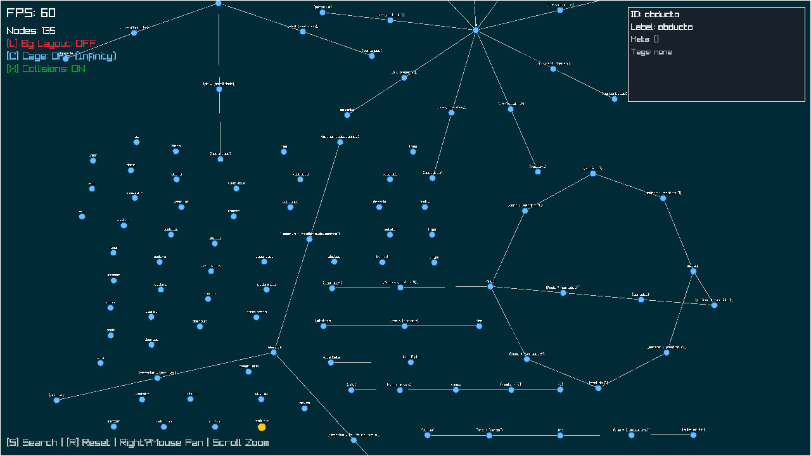
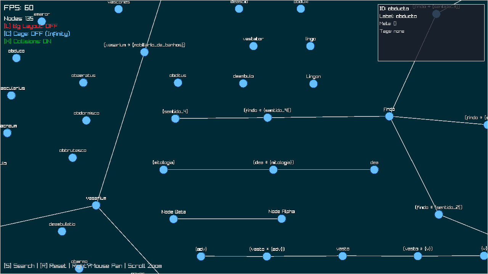

# SemanticGraphSearch

**Frase → Word → Fuzzy Latin Dictionary → Narsese (NAL) → JSON → Graph Visualizer**

This project implements a complete pipeline that takes a Portuguese (or Latin) phrase, tokenizes it, fuzzy‑matches each word against a Latin dictionary, retrieves pre‑generated Narsese (NAL) statements from a translation database, converts them to JSON, and finally sends them to a real‑time graph visualizer.

## 🖼️ Visual results

| Interactive graph view | Zoomed structured search |
|-----------------------|--------------------------|
|  |  |

The visualizer shows nodes and edges representing the Narsese terms and their relationships. You can drag, zoom, and search within the graph.

## 📁 Repository structure

```
SemanticGraphSearch/
├── dicionariolatino.com/         # Submodule: Latin dictionary + SQLite DB
├── latin_to_narsese/             # Submodule: Narsese translations (LLM generated)
├── RealtimeGraphVisualizer/      # Submodule: C + Python graph server
├── narsese2json.py               # NAL → JSON Lines converter
├── send2graph.py                 # Sends JSON to visualizer API
├── semantic.lua                  # Main pipeline script (Lua)
├── blob/                         # Screenshots for README
│   ├── demonstration.jpg
│   └── zoom_structured_search_frase.jpg
├── shell.nix                     # Nix environment with all dependencies
└── README.md
```

## 🚀 How it works

1. **Phrase tokenization** – splits input into words.
2. **Fuzzy Latin lookup** – Levenshtein‑based search against `dicionariolatino.com`’s SQLite database (excludes a known bad content hash).
3. **Narsese retrieval** – uses the word’s SHA‑256 hash to lookup a pre‑translated NAL statement from `latin_to_narsese/narseses_latim_portugues.db` (created by `translator.modular.py`).
4. **Clean NAL** – applies the same cleaning rules as `show_narseses.sh` (removes backticks, encloses in `<` … `>.`, fixes duplicates).
5. **JSON conversion** – pipes the clean NAL to `narsese2json.py`, which builds a graph AST and outputs JSON Lines.
6. **Graph visualisation** – sends the JSON Lines to `send2graph.py`, which uses the `RealtimeGraphVisualizer` API (default `http://localhost:5000`). Missing Python `requests` is provided on‑the‑fly via `uv run --with requests`.

## 🔧 Requirements

- **Nix** (recommended) – the `shell.nix` provides:
  - Lua 5.2 + `luasql-sqlite3`
  - Python 3 + `uv`
  - `pandoc`, `sha256sum`, `sqlite3`, etc.
- Submodules must be initialised:
  ```bash
  git submodule update --init --recursive
  ```
- The translation database `narseses_latim_portugues.db` should be pre‑populated by running `translator.modular.py` inside `latin_to_narsese/` (requires Ollama or Groq API).

## 📦 Running the pipeline

1. **Enter the Nix environment** (from project root):
   ```bash
   nix-shell
   ```

2. **Start the graph visualizer** (in a separate terminal, also inside `nix-shell`):
   ```bash
   cd RealtimeGraphVisualizer
   python3 app.py   # or ./run.sh
   ```
   The API will listen on `http://localhost:5000`.

3. **Execute the main script**:
   ```bash
   lua semantic.lua "amor est vitae essentia"
   ```
   Or pass any Latin/Portuguese phrase as an argument.

## 🧹 Cleaning fallback

If a word has no pre‑translated Narsese, the script falls back to a simple statement:
```
<word --> latinWord>.
```
You can customise `fallback_narsese()` inside `semantic.lua`.

## 🧪 Example output

```
Phrase: amore

--- Word: amore ---
Match: amor (score 0.200)
Using pre‑translated Narsese.
NAL:
< (amor * {sentimento}) --> amizade >.
<amor --> amicitia>.
JSON (first 200 chars): {"op": "add_node", "id": "(amor * {sentimento})", ...}
Graph response: ...
```

## 🛠️ Troubleshooting

| Issue | Likely fix |
|-------|-------------|
| `luasql.sqlite3` not found | Run inside `nix-shell` |
| `narseses_latim_portugues.db` missing | Run `latin_to_narsese/translator.modular.py` once |
| `ModuleNotFoundError: requests` | The script uses `uv run --with requests` – ensure `uv` is installed (provided by nix-shell) |
| Visualizer not showing nodes | Check that `send2graph.py` reaches the API (default `localhost:5000`). Start the visualizer first. |

## 📜 License

Same as the original repositories (see each submodule). This wrapper script is provided under the same terms.

---

**Enjoy exploring Latin semantics through Narsese and real‑time graphs!**
